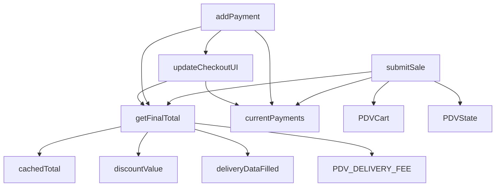

# Checkout Contracts — Documentação Técnica

> **Última atualização:** Janeiro 2026  
> **Funções críticas do checkout com contratos explícitos**

---

## 1. `getFinalTotal()`

**Arquivo:** `totals.js`

### Contrato

| Aspecto | Descrição |
|---------|-----------|
| **Input** | Nenhum parâmetro |
| **Output** | `Number` >= 0 |
| **Efeitos colaterais** | ❌ NENHUM (função pura de leitura) |

### Dependências

- `CheckoutState.cachedTotal`
- `CheckoutState.discountValue`
- `isEditingPaidOrder` (global PHP)
- `originalPaidTotal` (global PHP)
- `deliveryDataFilled` (flag global)
- `PDV_DELIVERY_FEE` (global PHP)

### Lógica atual

```
total = cachedTotal
se (editando pedido pago):
    total = max(0, total - originalPaidTotal)
total = total - desconto
se (entrega E dados preenchidos):
    total = total + taxa_entrega
retorna max(0, total)
```

### O que NÃO pode fazer

- ❌ Alterar qualquer estado
- ❌ Fazer chamadas assíncronas
- ❌ Acessar DOM para escrita

---

## 2. `submitSale()`

**Arquivo:** `submit.js`

### Contrato

| Aspecto | Descrição |
|---------|-----------|
| **Input** | Nenhum parâmetro (usa estado global) |
| **Output** | `void` (async) |
| **Efeitos colaterais** | ✅ MUITOS (ver abaixo) |

### Dependências de leitura

- `CheckoutState.currentPayments`
- `CheckoutState.discountValue`
- `CheckoutState.closingOrderId`
- `PDVCart.items` ou `cart` global
- `PDVState.getState()`
- Elementos DOM: `current_table_id`, `current_client_id`, `keep_open_value`, `.order-type-card.active`
- `getDeliveryData()` se for entrega

### Efeitos colaterais obrigatórios

1. `fetch()` POST para endpoint
2. `CheckoutUI.showSuccessModal()` em sucesso
3. `PDVCart.clear()` em sucesso
4. `cart.length = 0` (limpa global)
5. `window.location.reload()` ou `window.location.href` redirect

### Endpoints possíveis

| Condição | Endpoint |
|----------|----------|
| Venda normal | `/admin/loja/venda/finalizar` |
| Fechar mesa | `/admin/loja/mesa/fechar` |
| Fechar comanda | `/admin/loja/venda/fechar-comanda` |

### O que NÃO pode fazer

- ❌ Alterar cálculo de total
- ❌ Modificar payload sem motivo documentado
- ❌ Ignorar estado de `isPaidOrderInclusion`

---

## 3. `addPayment()`

**Arquivo:** `payments.js`

### Contrato

| Aspecto | Descrição |
|---------|-----------|
| **Input** | Nenhum (lê do DOM) |
| **Output** | `void` |
| **Efeitos colaterais** | ✅ Ver abaixo |

### Validações

1. Valor deve ser > 0 e numérico
2. Se método ≠ 'dinheiro' e valor > restante: trunca para restante

### Efeitos colaterais obrigatórios

1. Push em `CheckoutState.currentPayments`
2. Incrementa `CheckoutState.totalPaid`
3. Limpa input `pay-amount`
4. `CheckoutUI.updatePaymentList()`
5. `CheckoutUI.updateCheckoutUI()`
6. Foca em `btn-finish-sale` se pago total, senão preenche restante

### Regra de troco

```
Dinheiro: permite valor > total (gera troco)
Pix/Crédito/Débito: trunca para valor restante
```

### O que NÃO pode fazer

- ❌ Aceitar valor negativo ou zero
- ❌ Permitir troco em cartão/pix
- ❌ Alterar `cachedTotal`

---

## 4. `updateCheckoutUI()`

**Arquivo:** `ui.js`

### Contrato

| Aspecto | Descrição |
|---------|-----------|
| **Input** | Nenhum |
| **Output** | `void` |
| **Efeitos colaterais** | ✅ Apenas DOM |

### Elementos DOM atualizados

| ID | Valor |
|----|-------|
| `display-discount` | `- R$ X,XX` |
| `display-paid` | `R$ X,XX` |
| `display-remaining` | `R$ X,XX` |
| `checkout-total-display` | `R$ X,XX` |
| `checkout-change` | `R$ X,XX` (se troco) |
| `change-box` | `display: block/none` |
| `btn-finish-sale` | `disabled: true/false`, `background`, `cursor` |

### Lógica do botão

```
se (remaining <= 0.01):
    habilita botão (verde)
    se (remaining < -0.01): mostra troco
senão:
    desabilita botão (cinza)

se (retirada sem cliente):
    força desabilitar botão
```

### O que NÃO pode fazer

- ❌ Alterar estado
- ❌ Fazer fetch
- ❌ Chamar outras funções de lógica

---

## 5. `selectOrderType(type, element)`

**Arquivo:** `orderType.js`

### Contrato

| Aspecto | Descrição |
|---------|-----------|
| **Input** | `type`: `'local'|'retirada'|'entrega'`, `element`: HTMLElement ou null |
| **Output** | `void` |
| **Efeitos colaterais** | ✅ Ver abaixo |

### Efeitos por tipo

| Tipo | `keep_open_value` | Alerta mostrado | Botão "Pagar Depois" |
|------|-------------------|-----------------|----------------------|
| `local` | `'false'` | Nenhum | Escondido |
| `retirada` | `'true'` | `retirada-client-alert` | Visível (requer cliente) |
| `entrega` | `'false'` | `entrega-alert` | Visível (requer dados entrega) |

### Efeitos colaterais obrigatórios

1. Remove `.active` de todos os cards
2. Adiciona `.active` ao card selecionado
3. Atualiza `keep_open_value` hidden input
4. Mostra/esconde alertas apropriados
5. Habilita/desabilita `btn-save-pickup`
6. `CheckoutUI.updateCheckoutUI()`
7. `lucide.createIcons()` se disponível

### O que NÃO pode fazer

- ❌ Alterar pagamentos
- ❌ Alterar total
- ❌ Submeter pedido

---

## Resumo de Dependências Críticas


