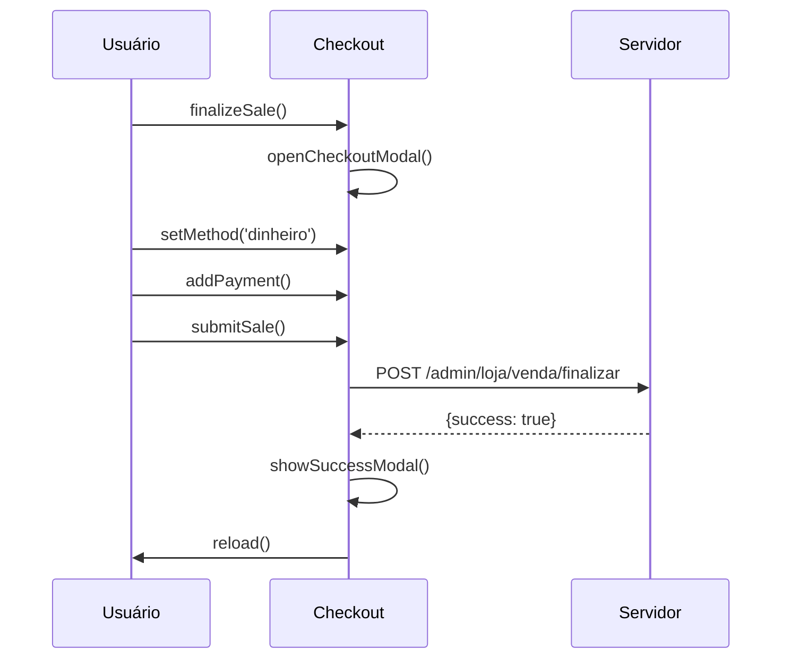
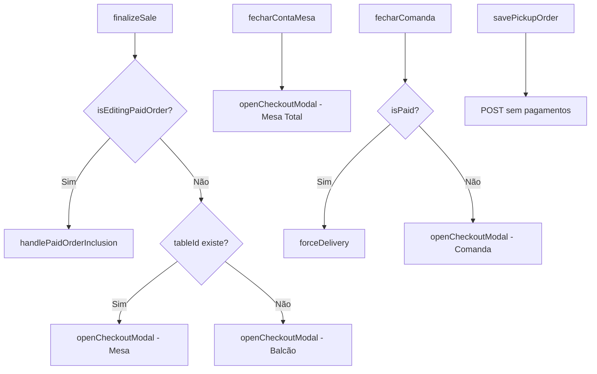

# Checkout Flows — Documentação Técnica

> **Última atualização:** Janeiro 2026  
> **Fluxos reais de runtime do checkout**

---

## 1. Venda Local (Balcão)

O fluxo mais simples: cliente paga na hora e leva.

### Passo a passo

| # | Ação do usuário | Função chamada | Estado alterado |
|---|-----------------|----------------|-----------------|
| 1 | Adiciona produtos | `PDVCart.add()` | `PDVCart.items` |
| 2 | Clica "Finalizar" | `finalizeSale()` | `modo: 'balcao'` |
| 3 | Modal abre | `openCheckoutModal()` | Reset completo do `CheckoutState` |
| 4 | (Opcional) Aplica desconto | `applyDiscount()` | `discountValue` |
| 5 | Seleciona método | `setMethod()` | `selectedMethod` |
| 6 | Adiciona pagamento | `addPayment()` | `currentPayments`, `totalPaid` |
| 7 | Clica "Concluir Venda" | `submitSale()` | — |
| 8 | Sucesso | `showSuccessModal()` | `PDVCart` limpo |
| 9 | Reload | — | Tudo resetado |

### Diagrama



---

## 2. Venda Mesa

Cliente consume na mesa, adiciona itens, depois fecha a conta.

### Passo a passo

| # | Ação | Função | Estado |
|---|------|--------|--------|
| 1 | Seleciona mesa (barra lateral) | — | `current_table_id` preenchido |
| 2 | Adiciona produtos | `PDVCart.add()` | `PDVCart.items` |
| 3 | (Opcional) Salva na conta | `saveClientOrder()` | Pedido persistido |
| 4 | Clica "Fechar Mesa" | `fecharContaMesa(mesaId)` | `modo: 'mesa', fechandoConta: true` |
| 5 | Modal abre com total da mesa | — | `cachedTotal` = total acumulado |
| 6 | Processa pagamento | (igual Local) | — |
| 7 | Concluir | `submitSale()` → endpoint `/mesa/fechar` | — |

### Diferença principal

- O `cachedTotal` vem de `table-initial-total` (total acumulado da mesa)
- Endpoint diferente: `/admin/loja/mesa/fechar`

---

## 3. Venda Comanda

Similar à mesa, mas vinculada a cliente específico.

### Passo a passo

| # | Ação | Função | Estado |
|---|------|--------|--------|
| 1 | Seleciona cliente | — | `current_client_id` preenchido |
| 2 | Adiciona produtos | `PDVCart.add()` | `PDVCart.items` |
| 3 | Salva na comanda | `saveClientOrder()` | Pedido persistido sem pagamento |
| 4 | Clica "Finalizar/Entregar" | `fecharComanda(orderId)` | `modo: 'comanda', closingOrderId` |
| 5 | Modal abre | — | — |
| 6 | Processa pagamento | (igual Local) | — |
| 7 | Concluir | `submitSale()` → endpoint `/venda/fechar-comanda` | — |

### Caso especial: Comanda já paga

Se `current_order_is_paid == 1`:
1. Usuário recebe confirmação: "Este pedido já está PAGO. Deseja entregá-lo?"
2. Chama `forceDelivery(orderId)`
3. Não abre modal de pagamento

---

## 4. Retirada (Pagar Agora)

Cliente paga agora, mas retira depois.

### Passo a passo

| # | Ação | Função | Estado |
|---|------|--------|--------|
| 1 | Adiciona produtos | `PDVCart.add()` | — |
| 2 | Clica "Finalizar" | `finalizeSale()` | — |
| 3 | Seleciona "Retirada" | `selectOrderType('retirada')` | `keep_open_value: 'true'` |
| 4 | Vincula cliente | (seletor lateral) | `current_client_id` |
| 5 | Processa pagamento | (igual Local) | `is_paid: 1` |
| 6 | Concluir | `submitSale()` | Pedido salvo como PAGO + aberto |

### Requisitos

- ⚠️ **Obrigatório vincular cliente OU mesa** para habilitar botão

---

## 5. Retirada (Pagar Depois)

Cliente não paga agora, retira e paga depois.

### Passo a passo

| # | Ação | Função | Estado |
|---|------|--------|--------|
| 1 | Adiciona produtos | `PDVCart.add()` | — |
| 2 | Clica "Finalizar" | `finalizeSale()` | — |
| 3 | Seleciona "Retirada" | `selectOrderType('retirada')` | — |
| 4 | Vincula cliente | (seletor lateral) | `current_client_id` |
| 5 | **NÃO adiciona pagamento** | — | `currentPayments: []` |
| 6 | Clica "Pagar Depois" | `savePickupOrder()` | — |

### Payload

```json
{
  "order_type": "pickup",
  "is_paid": 0,
  "payments": []
}
```

---

## 6. Entrega (Com Taxa)

Pedido para entrega com taxa automática.

### Passo a passo

| # | Ação | Função | Estado |
|---|------|--------|--------|
| 1 | Adiciona produtos | `PDVCart.add()` | — |
| 2 | Clica "Finalizar" | `finalizeSale()` | — |
| 3 | Seleciona "Entrega" | `selectOrderType('entrega')` | Alerta aparece |
| 4 | Clica "Preencher Dados" | `openDeliveryPanel()` | Painel abre |
| 5 | Preenche nome, endereço, bairro | — | — |
| 6 | Clica "Confirmar" | `confirmDeliveryData()` | `deliveryDataFilled: true` |
| 7 | **Total atualizado com taxa** | `getFinalTotal()` | `+PDV_DELIVERY_FEE` |
| 8 | Processa pagamento | (igual Local) | — |
| 9 | Concluir | `submitSale()` | `delivery_data` incluído no payload |

### Campos de entrega

| Campo | Obrigatório |
|-------|-------------|
| Nome | ✅ |
| Endereço | ✅ |
| Bairro | ✅ |
| Número | ❌ |
| Telefone | ❌ |
| Complemento | ❌ |

---

## 7. Entrega (Pagar Depois)

Entrega sem pagamento imediato.

### Passo a passo

| # | Ação | Função | Estado |
|---|------|--------|--------|
| 1-6 | (Igual Entrega com Taxa) | — | — |
| 7 | **NÃO adiciona pagamento** | — | — |
| 8 | Clica "Pagar Depois" | `savePickupOrder()` | — |

### Validação

- ⚠️ Se `deliveryDataFilled === false`, exibe alerta e abre painel

---

## 8. Edição de Pedido Pago

Adicionar novos itens a um pedido que já foi pago.

### Contexto

- Usuário clicou em pedido PAGO no Kanban → "Editar Pedido"
- `isEditingPaidOrder: true` foi setado pelo PHP
- `originalPaidTotal` contém o valor já pago

### Passo a passo

| # | Ação | Função | Estado |
|---|------|--------|--------|
| 1 | Adiciona novos produtos | `PDVCart.add()` | — |
| 2 | Clica "Incluir na Conta" | `finalizeSale()` | — |
| 3 | Detecta edição paga | `handlePaidOrderInclusion()` | `isPaidOrderInclusion: true` |
| 4 | Modal abre | — | Total = carrinho atual (sem original) |
| 5 | Paga a DIFERENÇA | `addPayment()` | — |
| 6 | Concluir | `submitSale()` | `order_id`, `save_account: true` |

### Cálculo do total

```
totalExibido = carrinhoAtual - originalPaidTotal (se > 0)
```

---

## Resumo Visual


