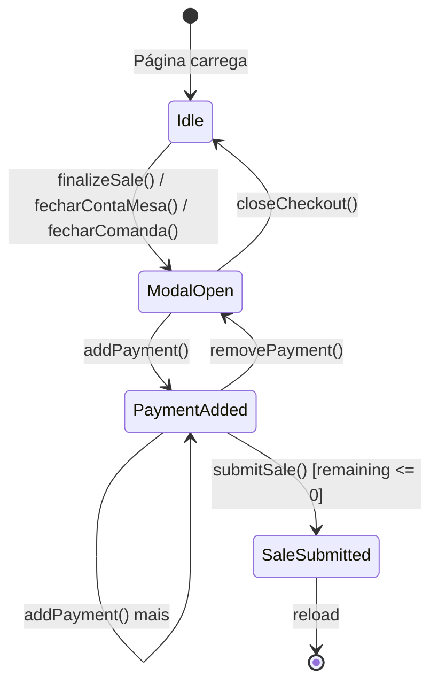

# Checkout State — Documentação Técnica

> **Última atualização:** Janeiro 2026  
> **Arquivo:** `public/js/pdv/checkout/state.js`

---

## 1. Estado Central (`CheckoutState`)

O estado do checkout é gerenciado pelo objeto global `window.CheckoutState`.

### Propriedades

| Propriedade | Tipo | Valor Inicial | Descrição |
|-------------|------|---------------|-----------|
| `currentPayments` | `Array` | `[]` | Lista de pagamentos adicionados |
| `totalPaid` | `Number` | `0` | Soma dos valores pagos |
| `discountValue` | `Number` | `0` | Valor de desconto aplicado |
| `cachedTotal` | `Number` | `0` | Total armazenado quando modal abre |
| `selectedMethod` | `String` | `'dinheiro'` | Método de pagamento selecionado |
| `closingOrderId` | `Number\|null` | `null` | ID da comanda sendo fechada |

### Onde são alteradas

| Propriedade | Alterada por |
|-------------|--------------|
| `currentPayments` | `CheckoutPayments.addPayment()`, `CheckoutPayments.removePayment()` |
| `totalPaid` | `CheckoutPayments.addPayment()`, `CheckoutPayments.removePayment()` |
| `discountValue` | `CheckoutTotals.applyDiscount()` |
| `cachedTotal` | `PDVCheckout.openCheckoutModal()` |
| `selectedMethod` | `CheckoutPayments.setMethod()` |
| `closingOrderId` | `PDVCheckout.fecharComanda()` |

### Quem pode ler

Todos os módulos têm acesso de leitura via `CheckoutState.*` ou via getters na fachada `PDVCheckout.*`.

---

## 2. Métodos de Reset

### `CheckoutState.reset()`
Reseta **todas** as propriedades para valores iniciais.  
**Chamado por:** `PDVCheckout.openCheckoutModal()`

### `CheckoutState.resetPayments()`
Reseta apenas `currentPayments` e `totalPaid`.  
**Chamado por:** `PDVCheckout.handlePaidOrderInclusion()`, `fecharContaMesa()`, `fecharComanda()`, `closeCheckout()`

---

## 3. Flags Globais (fora do CheckoutState)

| Flag | Arquivo | Tipo | Descrição |
|------|---------|------|-----------|
| `deliveryDataFilled` | `entrega.js` | `Boolean` | Se dados de entrega foram preenchidos |
| `window.isPaidOrderInclusion` | `index.js` | `Boolean` | Se está incluindo itens em pedido já pago |

### Ciclo de vida das flags

```
deliveryDataFilled:
  false (inicial)
  → true (confirmDeliveryData)
  → false (closeCheckout via _resetDeliveryOnClose)

isPaidOrderInclusion:
  undefined (inicial)
  → true (handlePaidOrderInclusion)
  → lido por submitSale
```

---

## 4. Dependências Externas

### Objetos JS globais usados pelo checkout

| Nome | Definido em | Uso |
|------|-------------|-----|
| `PDVState` | `state.js` | Controle de modo (balcao/mesa/comanda) |
| `PDVCart` | `cart.js` | Itens do carrinho e cálculo de total |
| `lucide` | CDN externa | Renderização de ícones |

### Variáveis inline do PHP (dashboard.php)

| Nome | Tipo | Uso |
|------|------|-----|
| `BASE_URL` | `String` | Base para URLs de API |
| `PDV_DELIVERY_FEE` | `Number` | Taxa de entrega |
| `isEditingPaidOrder` | `Boolean` | Se está editando pedido pago |
| `originalPaidTotal` | `Number` | Total original do pedido pago |
| `editingPaidOrderId` | `Number` | ID do pedido sendo editado |

---

## 5. Estado Derivado (calculado)

Valores que não são armazenados, mas calculados sob demanda:

| Valor | Calculado por | Dependências |
|-------|---------------|--------------|
| `finalTotal` | `CheckoutTotals.getFinalTotal()` | `cachedTotal`, `discountValue`, `deliveryDataFilled`, `PDV_DELIVERY_FEE` |
| `remaining` | `finalTotal - totalPaid` | `finalTotal`, `totalPaid` |
| `change` (troco) | `abs(remaining)` quando `remaining < 0` | `remaining` |

---

## 6. Diagrama de Ciclo de Vida


